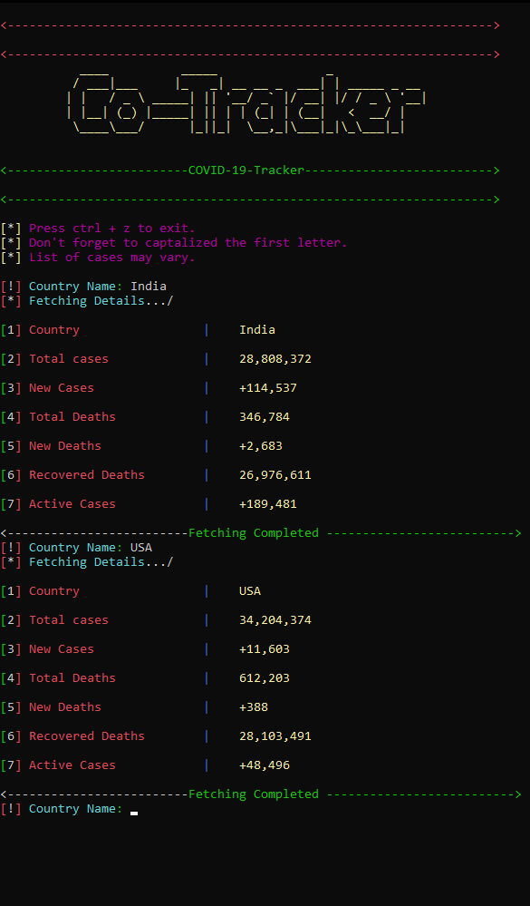

# CoTracker
CoTracker is a tracker written in python that provides the number of cases and deaths from novel coronavirus among the countries.

This project, written in python, was based on uploading and analyzing the attendance of students which is particular function of a General ERP system. The project was made to manage and automate the daily attendance in schools/colleges.

# [ installation ]
```
$ apt update && apt upgrade -y
$ apt install git python3
$ git clone https://github.com/Akash-github1/CoTracker
$ cd CoTracker
$ python Cotracker.py

```

# Screenshot



